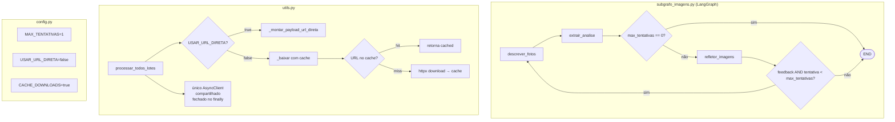

# Design Document — Otimização do Agente de Avaliação de Imagens

## Escopo

Este documento cobre apenas os requisitos **1, 2, 4 e 6** do `requirements.md`. Os requisitos 3 e 5 estão fora do escopo desta iteração.

---

## Overview

O módulo `src/agente_avaliacao_imagens` é um subgrafo LangGraph com três nós:
`descrever_fotos → extrair_analise → refletor_imagens`. O loop de reflexão pode
repetir o ciclo completo até `MAX_TENTATIVAS` vezes.

As quatro otimizações implementadas neste design visam:

1. **Req 1** — Tornar o número de iterações do loop de reflexão configurável via env var, com `MAX_TENTATIVAS` padrão reduzido de `2` para `1`, e suporte a `0` para desativar completamente o nó `refletor_imagens`.
2. **Req 2** — Permitir envio de URLs originais ao LLM de visão sem download nem conversão para base64, via `IMAGENS_USAR_URL_DIRETA=true`.
3. **Req 4** — Usar um único `httpx.AsyncClient` compartilhado entre todos os lotes de uma mesma invocação, com fechamento garantido via `try/finally`.
4. **Req 6** — Cachear downloads em memória durante a execução de um imóvel, evitando re-downloads nas iterações do loop de reflexão (bypass automático quando `USAR_URL_DIRETA=true`).

---

## Architecture



---

## Components and Interfaces

### `config.py` — Novas variáveis de ambiente (Req 1, 2, 6)

| Variável | Tipo | Padrão | Descrição |
|---|---|---|---|
| `IMAGENS_MAX_TENTATIVAS` | `int` | `1` | Máximo de iterações do loop de reflexão. `0` desativa o refletor. Intervalo válido: `[0, 10]`. |
| `IMAGENS_USAR_URL_DIRETA` | `bool` | `false` | Envia URLs originais ao LLM sem download/base64. Requer suporte do modelo LLM_Visão a URLs externas. |
| `IMAGENS_CACHE_DOWNLOADS` | `bool` | `true` | Ativa cache em memória de downloads por invocação de `processar_todos_lotes`. |

**Lógica de validação para `MAX_TENTATIVAS`:**

```python
def _parse_max_tentativas(raw: str) -> int:
    try:
        val = int(raw)
        if val < 0 or val > 10:
            raise ValueError(f"fora do intervalo [0, 10]: {val}")
        return val
    except (ValueError, TypeError) as e:
        logger.warning("IMAGENS_MAX_TENTATIVAS inválido (%s), usando padrão 1. Erro: %s", raw, e)
        return 1
```

**Lógica de leitura para booleanos:**

```python
def _parse_bool(raw: str, default: bool) -> bool:
    return raw.strip().lower() in ("1", "true", "yes") if raw else default
```

---

### `utils.py` — Cliente compartilhado, cache e URL direta (Req 2, 4, 6)

#### Req 4 — `AsyncClient` único com `try/finally`

Atualmente cada lote cria seu próprio `AsyncClient` dentro de `_com_semaforo`. O novo design extrai o cliente para o nível de `processar_todos_lotes`:

```python
async def processar_todos_lotes(dados_fotos, tamanho_lote, prompt=...) -> str:
    client = httpx.AsyncClient(timeout=TIMEOUT_DOWNLOAD, follow_redirects=True)
    try:
        # distribuir client para todos os lotes
        resultados = await asyncio.gather(...)
    finally:
        await client.aclose()
```

#### Req 6 — Cache em memória por invocação

O cache é um `dict[str, tuple[str, str]]` (URL → `(mime, base64)`) criado localmente em `processar_todos_lotes`. Ele é passado para `_baixar`, que o consulta antes de fazer download:

```python
async def _baixar(client, url, cache: dict | None = None) -> tuple[str, str] | None:
    if cache is not None and url in cache:
        return cache[url]
    resultado = ... # download HTTP
    if resultado is not None and cache is not None:
        cache[url] = resultado
    return resultado
```

O cache é descartado ao final de `processar_todos_lotes` (variável local — sem estado global).

#### Req 2 — Payload com URL direta

Nova função `_montar_item_url_direta(url: str, idx: int) -> dict | None`:

```python
def _montar_item_url_direta(url: str, idx: int) -> dict | None:
    if not url:
        logger.warning("URL vazia na posição %d, omitindo do payload.", idx)
        return None
    return {"type": "image_url", "image_url": {"url": url}}
```

Em `_processar_um_lote`, a ramificação é:

```python
if USAR_URL_DIRETA:
    itens = [_montar_item_url_direta(u, i) for i, u in enumerate(urls)]
    conteudo = [{"type": "text", "text": prompt}] + [x for x in itens if x]
else:
    downloads = await asyncio.gather(*[_baixar(client, u, cache) for u in urls])
    conteudo = _montar_conteudo_base64(prompt, downloads)
```

---

### `subgrafo_imagens.py` — Skip do refletor quando `MAX_TENTATIVAS=0` (Req 1)

Mudança no `builder` do StateGraph: quando `MAX_TENTATIVAS == 0`, o edge de `extrair_analise` vai direto para `END` sem passar por `refletor_imagens`.

A abordagem mais simples e correta é **condicionar o roteamento no nó `extrair_analise`** usando uma conditional edge:

```python
def decidir_apos_extracao(state: SubgrafoImagensState) -> Literal["refletor_imagens", "__end__"]:
    if state.max_tentativas == 0:
        logger.info("MAX_TENTATIVAS=0: refletor_imagens ignorado.")
        return "__end__"
    return "refletor_imagens"

builder.add_conditional_edges(
    "extrair_analise",
    decidir_apos_extracao,
    {"refletor_imagens": "refletor_imagens", "__end__": END},
)
```

Isso garante que o nó `refletor_imagens` nunca é executado quando `max_tentativas == 0`, independentemente do conteúdo do estado.

---

## Data Models

Não há mudanças nos modelos Pydantic (`AnaliseImagens`, `FeedbackImagens`).

`SubgrafoImagensState` já possui `max_tentativas: int = MAX_TENTATIVAS`. O valor padrão muda de `2` para `1` porque `config.py` passa a ler `MAX_TENTATIVAS` com padrão `1`.

---

## Correctness Properties

*Uma propriedade é uma característica ou comportamento que deve ser verdadeiro em todas as execuções válidas de um sistema — essencialmente, uma declaração formal sobre o que o sistema deve fazer. Propriedades servem como ponte entre especificações legíveis por humanos e garantias de corretude verificáveis por máquina.*

### Property 1: MAX_TENTATIVAS=0 nunca executa o refletor

*Para qualquer* estado de `SubgrafoImagensState` com `max_tentativas=0` e qualquer lista de URLs de fotos, após a execução completa do subgrafo, o nó `refletor_imagens` deve ter sido invocado exatamente zero vezes.

**Validates: Requirements 1.2**

---

### Property 2: Limite de iterações do refletor é respeitado

*Para qualquer* valor de `max_tentativas` em `[1, 3]` e qualquer sequência de feedbacks retornados pelo refletor, o número total de vezes que `refletor_imagens` é executado deve ser menor ou igual a `max_tentativas`.

**Validates: Requirements 1.3, 1.6**

---

### Property 3: Payload URL direta não contém base64

*Para qualquer* lista não-vazia de URLs válidas com `USAR_URL_DIRETA=true`, o conteúdo do payload montado para o LLM deve conter apenas entradas do tipo `{"type": "image_url", "image_url": {"url": <url_original>}}` para as imagens, sem nenhum dado base64 e sem que nenhum download HTTP seja realizado.

**Validates: Requirements 2.2**

---

### Property 4: URL vazia com URL_DIRETA é omitida do payload

*Para qualquer* lista de URLs contendo strings vazias misturadas com URLs válidas e com `USAR_URL_DIRETA=true`, as strings vazias devem ser omitidas do payload e o número de entradas de imagem no payload deve ser igual ao número de URLs não-vazias.

**Validates: Requirements 2.4**

---

### Property 5: Exatamente um AsyncClient por invocação

*Para qualquer* lista de URLs que resulte em N lotes, a função `processar_todos_lotes` deve instanciar exatamente um `httpx.AsyncClient` e esse mesmo objeto deve ser passado para todos os N lotes.

**Validates: Requirements 4.1, 4.2**

---

### Property 6: AsyncClient é fechado independentemente de falhas em lotes

*Para qualquer* combinação de lotes bem-sucedidos e lotes que lançam exceção, ao final da invocação de `processar_todos_lotes`, o `httpx.AsyncClient` deve ter sido fechado exatamente uma vez — mesmo quando exceções ocorrem em lotes individuais.

**Validates: Requirements 4.3, 4.5, 4.6**

---

### Property 7: Cache evita re-download de URL já baixada

*Para qualquer* URL e conteúdo de imagem, quando a mesma URL é solicitada duas vezes dentro da mesma invocação de `processar_todos_lotes` com `CACHE_DOWNLOADS=true`, exatamente uma requisição HTTP deve ser feita e ambas as chamadas devem retornar o mesmo par `(mime, base64)`.

**Validates: Requirements 6.3**

---

### Property 8: Cache não é criado quando URL_DIRETA está ativa

*Para qualquer* lista de URLs com `USAR_URL_DIRETA=true`, nenhuma estrutura de cache deve ser criada e nenhum download HTTP deve ser realizado dentro de `processar_todos_lotes`.

**Validates: Requirements 6.6**

---

### Property 9: Falha de download não contamina o cache

*Para qualquer* URL que resulta em falha de download (exceção HTTP ou timeout), após a tentativa de download, a URL não deve estar presente no `CacheDownload`, garantindo que uma nova invocação tente o download novamente.

**Validates: Requirements 6.7**

---

## Error Handling

| Situação | Comportamento |
|---|---|
| `IMAGENS_MAX_TENTATIVAS` inválido (não-inteiro ou fora de `[0,10]`) | Log warning + usar padrão `1` |
| URL vazia com `USAR_URL_DIRETA=true` | Log warning com posição + omitir do payload |
| LLM retorna falha de acesso a URL com `USAR_URL_DIRETA=true` | Log warning com URL e motivo |
| Lote lança exceção | Log error com índice e tipo + continuar demais lotes + `AsyncClient` não fechado prematuramente |
| Download falha com cache ativo | `None` retornado + URL não inserida no cache |
| `AsyncClient` com exceção não tratada propagando | `finally` garante `client.aclose()` antes do re-raise |

---

## Testing Strategy

Esta feature envolve lógica de negócio pura (roteamento de grafo, montagem de payload, cache em memória, gerenciamento de cliente HTTP), o que torna **property-based testing** apropriado para as propriedades 1–9.

### Biblioteca de PBT

**[Hypothesis](https://hypothesis.readthedocs.io/)** — biblioteca PBT padrão para Python.

### Abordagem por tipo de teste

**Testes de exemplo (pytest + AsyncMock):**
- Valor padrão de `MAX_TENTATIVAS` == 1
- Valor padrão de `USAR_URL_DIRETA` == False
- Valor padrão de `CACHE_DOWNLOADS` == True
- Comportamento de fallback com valores inválidos de env vars
- Log de aviso para URL vazia com URL_DIRETA

**Testes de propriedade (Hypothesis):**
- Property 1: `@given(st.lists(st.text()), ...)` — subgrafo com `max_tentativas=0` nunca chama refletor
- Property 2: `@given(st.integers(min_value=1, max_value=3), ...)` — contagem de invocações ≤ max
- Property 3: `@given(st.lists(st.from_regex(r'https://\S+', fullmatch=True)))` — payload sem base64
- Property 5: `@given(st.lists(..., min_size=1))` — contar instanciações de `AsyncClient`
- Property 6: `@given(...)` com lotes que lançam exceção — verificar `aclose()` chamado
- Property 7: `@given(st.binary(), st.text())` — cache retorna mesmo valor, 1 request HTTP
- Property 8: `@given(st.lists(...))` com URL_DIRETA=true — sem download nem cache
- Property 9: `@given(st.text())` com download falhando — URL não no cache

**Configuração mínima:**
```python
@settings(max_examples=100)
```

**Tag format:**
```python
# Feature: otimizacao-agente-imagens, Property 7: Cache evita re-download de URL já baixada
```

**Testes de integração:**
- Não aplicáveis diretamente (sem chamadas a serviços externos no escopo das otimizações)
- O roteador LLM é mockado em todos os testes de `processar_todos_lotes`
